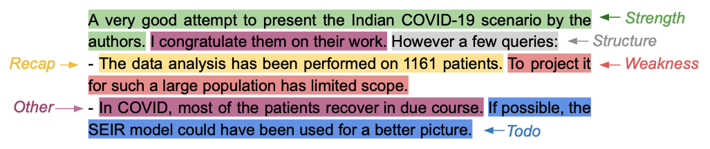

# PragTag-2023 Shared Task Archive

<p  align="center">
  
</p>

This repository archives the code and data for PragTag-2023: our shared task on **Low-Resource Multi-Domain Pragmatic Tagging of Peer Reviews** that took place as part of the [10th Argument Mining Workshop](https://argmining-org.github.io/2023/) at [EMNLP-2023](https://2023.emnlp.org). 

The data contained in this repository comes from the [NLPeer Dataset](https://github.com/UKPLab/nlpeer); if you use any of the data,
please cite NLPeer. The secret portion of the data comes from the COLING-20 data inside NLPEER, but it is newly annotated for 
pragmatic tags following the same guidelines and setup as the annotation data of F1000RD contained within NLPEER.

```
@inproceedings{dycke-etal-2023-nlpeer,
    title = "{NLP}eer: A Unified Resource for the Computational Study of Peer Review",
    author = "Dycke, Nils  and
      Kuznetsov, Ilia  and
      Gurevych, Iryna",
    booktitle = "Proceedings of the 61st Annual Meeting of the Association for Computational Linguistics (Volume 1: Long Papers)",
    month = jul,
    year = "2023",
    address = "Toronto, Canada",
    publisher = "Association for Computational Linguistics",
    url = "https://aclanthology.org/2023.acl-long.277",
    pages = "5049--5073"
}
```

## Summary

Approaches to low-data NLP processing for peer review remain under-investigated. Enabled by the recent release of open multi-domain corpora of peer reviews, the PragTag-2023 Shared Task explored the ways to increase domain robustness and address data scarcity in pragmatic tagging -- a sentence tagging task where review statements are classified by their argumentative function. This paper describes the shared task, outlines the participating systems, and summarizes the results.

<p  align="center">
  
</p>


## Quick Start and Setup

Download the repo
```shell
git clone https://github.com/UKPLab/pragtag2023
```

If you want to test your model on the shared task data:
```python
import json
from code.evaluation.load import load_input_data

data = load_input_data("data/public_main/data/public_secret/test_inputs.json")

predictions = [{"sid": "output"}] # todo: run your model inference on the data to get predictions

with open("data/reference_secret/predicted.json", "w+") as f:
	json.dump(predictions, f)

```

Then simply run the evaluation script:
```shell
python3 code/evaluation/main.py data/reference_secret .

```


To get you started on the task, you can run the fine-tuning-based baseline (`roberta-base`). Run the following command to train the baseline:
```shell
python3 code/baseline/finetune_baseline.py data/public_main/train_inputs_full.json

```

## Repository Structure

```
> code = contains the starting kit participants received; runs baselines and evaluation of those
    > baseline = the simple fine-tuning baselines
    > evaluation = the evaluation scripts
> data = contains the public and secret data shares of the shared task
    > public_main = the inputs to the main test instances (from F1000RD)
    > public_secret = the inputs to the secret share (COLING-20, annotated) for testing
    > reference_main = the labels of the public_main instances
    > reference_secret = the labels of the public_secret instances
```


## Data

The data directory contains all test data of the shared task. As auxiliary data participants were free to use
the ARR-22 and F1000-22 (w/o pragmatic tags) portions of NLPEER. There were multiple test conditions, if you want to 
recreate them, please use the test script with the main and secret data.

If you want to load the data for other purposes, you should use the `test_labels.json` inside `reference_secret` and
the `test_inputs.json` inside `public_secret` to get the full dataset of pragmatic tagged reviews including the COLING20
and the F1000RD data.

Find more details in the README of the data folder.


## Final Participant Leaderboard

We report the F1-score per domain and averaged across all of them. The below table shows the final leaderboard on the
shared task.

|                     | mean | case | diso | iscb | rpkg | scip | secret |
|---------------------|----|----|----|----|----|----|---|
| [DeepBlueAI](https://www.aclanthology.org/2023.argmining-1.23.pdf)          | 84.1 | 82.9 | 84.1 | 82.8 | 86.0 | 89.0 | 80.1 |
| [NUS-IDS](https://aclanthology.org/2023.argmining-1.25.pdf)             | 83.2 | 83.8 | 85.4 | 83.3 | 84.8 | 87.8 | 74.1 |
| [MILAB](https://aclanthology.org/2023.argmining-1.24.pdf)               | 82.4 | 84.0 | 83.7 | 80.1 | 85.4 | 86.5 | 74.9 |
| [SuryaKiran](https://www.aclanthology.org/2023.argmining-1.26.pdf)          | 82.3 | 82.0 | 82.8 | 81.8 | 82.8 | 86.5 | 77.9 |
| [CATALPA](https://aclanthology.org/2023.argmining-1.22.pdf)             | 81.3 | 80.8 | 82.0 | 81.1 | 82.5 | 82.5 | 78.8 |
| | | | | | | | |
| Ensemble            | 84.4 | 84.0 | 85.2 | 83.3 | 87.3 | 88.7 | 78.0 |
| RoBERTa (Baseline)  | 80.3 | 80.3 | 80.8 | 79.9 | 83.1 | 83.8 | 73.7 |
| Majority (Baseline) | 8.0 | 9.3 | 7.3 | 7.5 | 8.6 | 7.9 | 7.3 |

## Citation

To cite the code and shared task, please use:

<code>@inproceedings{pragtag-2023,
title = "Overview of {P}rag{T}ag-2023: Low-Resource Multi-Domain Pragmatic Tagging of Peer Reviews",
author = {Dycke, Nils and Kuznetsov, Ilia and Gurevych, Iryna},
booktitle = "Proceedings of the 10th Workshop on Argument Mining",
month = Dec,
year = "2023",
address = "Singapore",
publisher = "Association for Computational Linguistics"}
</code>

To cite the data, please use: 
```
@inproceedings{dycke-etal-2023-nlpeer,
    title = "{NLP}eer: A Unified Resource for the Computational Study of Peer Review",
    author = "Dycke, Nils  and
      Kuznetsov, Ilia  and
      Gurevych, Iryna",
    booktitle = "Proceedings of the 61st Annual Meeting of the Association for Computational Linguistics (Volume 1: Long Papers)",
    month = jul,
    year = "2023",
    address = "Toronto, Canada",
    publisher = "Association for Computational Linguistics",
    url = "https://aclanthology.org/2023.acl-long.277",
    pages = "5049--5073"
}
```

## Contact
The shared task was organized by the members of the InterText initiative at the UKP Lab, Technical University of Darmstadt.

* Points of contact: [Nils Dycke](https://www.informatik.tu-darmstadt.de/ukp/ukp_home/staff_ukp/ukp_home_content_staff_1_details_109248.en.jsp), [Ilia Kuznetsov](https://www.informatik.tu-darmstadt.de/ukp/ukp_home/staff_ukp/ukp_home_content_staff_1_details_42944.en.jsp)
* E-mail inquiries: arr-data (at) ukp.tu-darmstadt.de
* Learn more about the [InterText initiative](https://intertext.ukp-lab.de)
* Learn more about the [UKP Lab](https://www.informatik.tu-darmstadt.de/ukp)


## DISCLAIMER

This repository contains experimental software and is published for the sole purpose of giving additional background details on the respective publication. 
